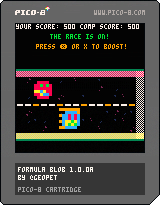

# Formula Blob

Formula Blob is a fast-paced, dynamic racing game built for the PICO-8 fantasy console. Players select their blob racer, strategize with boosts, and compete in thrilling races filled with surprises, animations, and celebrations.

## Features

### 🎮 Gameplay
- **Blob Selection:** Choose your racer with unique names and dynamic stats.
- **Boost Mechanics:** Strategically use boosts to gain an edge, but beware of overheating!
- **Race Odds:** Moneyline-style scoring system for risk/reward gameplay.
- **False Starts:** Randomized false starts add unpredictability to the countdown.

### 🎨 Visuals
- **Racetrack Background:** Immersive track visuals with added grit and texture.
- **Animated Blobs:** Unique animations for running, bobbing, and boosting states.
- **Start Screen Parade:** A lively, seamless blob parade to welcome players.

### 🎵 Audio
- **Dynamic Music:** Soundtrack changes based on game state for added excitement.
- **Sound Effects:** Boosts, false starts, and race results come alive with distinct audio cues.

### 🎉 Celebrations
- **Fireworks:** Celebrate victories with vibrant, animated fireworks.
- **Enhanced Result Screen:** Winning blobs take center stage with animations and crowns.

### 🛠️ Code Highlights
- **Helper Functions:** Simplified and reusable code for text alignment, blob rendering, and more.
- **Logging System:** Improved debugging with a `quick_log` table and toggled logging.

## Getting Started

### Requirements
- [PICO-8](https://www.lexaloffle.com/pico-8.php): The fantasy console required to run the game. *(Except for the web version!)*

There are three ways to play *Formula Blob*.

1. Play the browser version. **(Does not require PICO-8.)**
- [Play in Browser](https://geopet.github.io/formula-blob/) 

2. Download the cartridge png file and load it into PICO-8:  

<p align="center">
  
</p>

3. Download the .p8 file from this repo following these instructions:

### Installation
1. Download the `formula-blob.p8` cartridge file.
2. Open PICO-8 and load the cartridge:
   ```
   load formula-blob.p8
   ```
3. Run the game:
   ```
   run
   ```

## How to Play
1. **Select Your Blob:** Use the arrow keys to choose your racer and press `Z` to lock in.
2. **Boost Strategically:** Press `X` to boost during the race, but manage your boost meter to avoid overheating.
3. **Win the Race:** Cross the finish line first to claim victory and celebrate with fireworks!

## Development
Formula Blob was developed using the PICO-8 fantasy console, leveraging its unique constraints to create a polished and engaging experience. The game features modular code with helper functions for maintainability and future enhancements. [Read the Dev Blog](https://geopet.github.io/formula-blob/blog) to find out more!

## Changelog
See the [changelog](./changelog.md) for a detailed list of updates and improvements.

## License
This project is licensed under the MIT License. See the LICENSE file for details.

---

Enjoy the race and may the best blob win!
